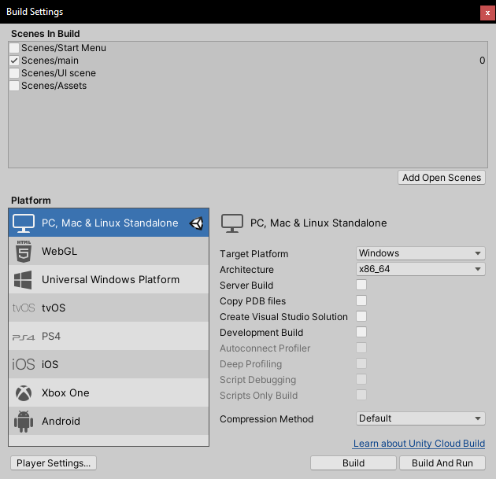

# Gevel-Configurator
Gevel Configurator project voor Stichting Happy Balance

## Contents
- [Files](#files)
- [Installation](#installation)
- [Running the Application](#running-the-application)
- [Usage](#usage)
- [Common Errors](#common-errors)
- [Tips](#tips)


## Files 

|File | Content |
|:----|:--------|
| [AssetSpawner.cs](https://github.com/KingPungy/Gevel-Configurator/blob/master/Gevel%20Configurator/Assets/Scripts/AssetSpawner.cs) | Used to load objects from an Import_Folder and display them as panels in the Asset Menu that can be clicked to spawn the object|
| [GizmoManager.cs](https://github.com/KingPungy/Gevel-Configurator/blob/master/Gevel%20Configurator/Assets/Scripts/GizmoManager.cs) | Used to attach Moving/Rotating/Scaling Gizmos to selected objects and for Copy/Pasting objects |
| [Object_overzicht.cs](https://github.com/KingPungy/Gevel-Configurator/blob/master/Gevel%20Configurator/Assets/Scripts/Objects_overzicht.cs)| This script calculates the total surface area per surface group and stores this data in a dictionary that is used to export to an excel file or show in the "overzicht panel" |
| [SurfaceOverzicht.cs](https://github.com/KingPungy/Gevel-Configurator/blob/master/Gevel%20Configurator/Assets/Scripts/SurfaceOverzicht.cs) | This script  manages the Surface overzicht panel in the view dropdown. It makes sure the text is properly aligned and that the toggle button above switches between cm²/m² |
| [SurfaceAreaGroup.cs](https://github.com/KingPungy/Gevel-Configurator/blob/master/Gevel%20Configurator/Assets/Scripts/SurfaceAreaGroup.cs) | This script gets attached to each object and stores the names of the surface groups it is a part of, and whether or not it needs to be counted |
| [SceneObjects.cs](https://github.com/KingPungy/Gevel-Configurator/blob/master/Gevel%20Configurator/Assets/Scripts/SceneObjects.cs) | This script manages the list of objects on the side of the screen, and also the properties menu below that |
| [SelectAsset.cs](https://github.com/KingPungy/Gevel-Configurator/blob/master/Gevel%20Configurator/Assets/Scripts/SelectAsset.cs) | This script handles the clicking on the asset panels so that when you double click it spawns the object using a function inside the [GizmoManager.cs](https://github.com/KingPungy/Gevel-Configurator/blob/master/Gevel%20Configurator/Assets/Scripts/GizmoManager.cs) |
| [SelectObject.cs](https://github.com/KingPungy/Gevel-Configurator/blob/master/Gevel%20Configurator/Assets/Scripts/SelectObject.cs) | This script handles the selecting of objects. It makes sure that the object you select also exists in the scene objects list and then selects it in both the scene and the side menu |
| [ViewMode.cs](https://github.com/KingPungy/Gevel-Configurator/blob/master/Gevel%20Configurator/Assets/Scripts/ViewMode.cs) | This script contains functions that cause a switch between working mode and view mode. In view mode all UI is hidden except for the close button |


## Installation
First off you'll need to download [Unity Hub & Unity3D](https://unity3d.com/get-unity/download).  

Once those are installed its time to clone this repository into your desired folder. 
Next you start up Unity Hub and follow any necessary instructions until you arrive at an empty Projects screen.

Click on [ ADD ] to open a project existing on your computer.

<details open>
<summary>Unity Hub projects</summary>
<br> 
 
   
 
</details>
 
This will open a 'Select a project to open...' panel in which you will select the highlighted folder inside the cloned repository to open the Unity3D project. 

<details open>
<summary>Project Selection panel</summary>
<br> 
 


</details>

## Running the Application

After you've followed the previous steps you'll be ready to open the project.  

The first time you open the project you might be greeted with an empty screen without any scenes loaded. 
To populate the Scene drag a Unity Scene from the Assets/Scenes folder into the Hierarchy tab. The most up to date scene should be main.unity .  

To build and run the application you first need to set the desired build folder. To access the build settings see picture below. 

<details open>
<summary>File/Build Settings</summary>
<br> 
 


</details>  

This will open the following menu.

<details open>
<summary>Build Settings Menu</summary>
<br> 
 


</details>  

Press the [ Build ] button and a 'Build Windows' panel will open. Select the highlighted folder inside the repository folder. If this folder does not exist create a folder with the name B/build. Folders with this name will be ignored and not uploaded to Github.

<details open>
<summary>Build Windows Panel</summary>
<br> 
 


</details>

After Selecting the build folder the application will begin building and saving into the target folder. The application can now be run by executing the 'Gevel Configurator.exe' inside the build folder. 

###### PS. Make sure there are no errors otherwise the application can not be build. Errors sometimes only arise when trying to build so do this regularly.

## Usage

### Table of contents
- [Keybindings](#keybindings)
- [Navigation Bar Buttons](#navigation-bar-buttons)
  * [File Dropdown](#file-dropdown)
  * [Edit Dropdown](#edit-dropdown)
  * [View Dropdown](#view-dropdown)
- [Menus](#menus)
  * [Objects List](#objects-list)
  * [Properties](#properties)
  * [Asset Menu](#asset-menu)

### Keybindings

Gizmo tools types and shortcuts

<details>
<summary>Keybindings</summary>
<br> 
 
|Tool|Keybind|
|:---|:------|
| Move Tool              | W |
| Rotating Tool          | E |
| Scaling Tool           | R |
| Universal tool         | T |
| Transform Space Global | G |
| Transform Space Local  | L |
| Copy                   | Crtl + C |
| Paste                  | Crtl + V |
| Delete                 | Del |
| Alternate Tool Mode    | Hold LShift while using a tool |

</details>

### Navigation Bar Buttons

#### File Dropdown
<details>
<summary>File Drowpdown menu</summary>
<br> 
 
|Button|Use|
|:-----|:--|
| New     | W.I.P |
| Load    | W.I.P |
| Save    | W.I.P |
| Save As | W.I.P |
| Import  | W.I.P |
| Settings| W.I.P |
| Quit    | Exit Application |

</details>

#### Edit Dropdown
<details>
<summary>Edit Drowpdown menu</summary>
<br> 
 
|Button|Use|
|:-----|:--|
| Redo       | redo's last move/rotate/scale action |
| Undo       | undo's last move/rotate/scale action |
| Copy       | W.I.P |
| Cut        | W.I.P |
| Paste      | W.I.P |
| Asset Menu | Opens Asset menu |

</details>


#### View Dropdown
<details>
<summary>View Drowpdown menu</summary>
<br> 
 
|Button|Use|
|:-----|:--|
| Overzicht | Opens panel that shows surface Totals and a button for exporting to Excel |
| Demo (F5) | Hides all UI for presentation, does not restrict tool use |

</details>

### Menus

#### Objects List
Shows all objects in the scene in a scrollable viewport on the right side of the screen

#### Properties
Is supposed to show basic information about the object such as:
- W.I.P Size
- W.I.P Surface Group
- Background color of the object
- W.I.P background Image
- W.I.P Object Name

#### Asset Menu

Double Clicking on a object preview spawns the object i the scene between the camera and the object you are looking at.

- W.I.P Search bar
- W.I.P Import Button to import new assets into your project


### Common Errors
- NullReferenceException : This means you have a null as value instead of the type you acctualy need. To not have this error make sure you check if the variable you want to access is not (!=) null, and also try to assign a newly created variable with a "new" of that type. For instance: 
```c#
public Dictionary<String,Float> randomDictionary = new Dictionary<String,Float>(); 
```

### Tips
- When starting off take your time to allign a single row of a building so that you can copy an entire floor and paste the rest.


